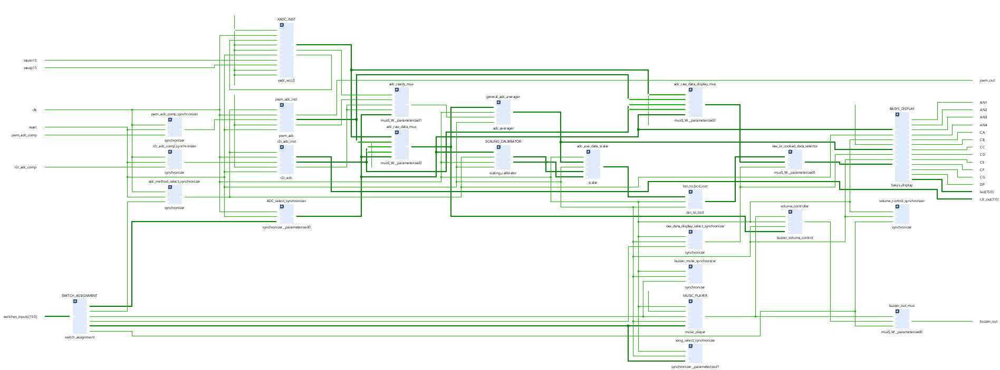

*
 Vikram Procter | Nov, 2025 
*

# FPGA MIDI Buzzer Player

## Project Overview
  
*Photo of finished project*

Put lots of over view here

## Systems Overview
  
*RTL Schematic Generated Using Vivado*

Write about the music part

the adc part

and the pcb part

## MIDI Music Player 
### Python MIDI Interperter

The metal detection system is designed around a 555 timer IC and inductor capacitor (LC) circuit. The 555 timer produces an AC input in which the frequency response output varies with changes in inductance. By exposing the inductor coil placed on the bottom of the car to a copper sheet the inductance of the coil changes and the frequency of the output changes in response.

The sensor board uses a built in timer module of the AVR128DB28 to measure the frequency of the LC circuit. By tuning a threshold, the recorded frequency could be used to identify if the coil was exposed to metal. This information was then relayed over I2C to the ECU.

### System Verilog Music Playback
An ultrasonic distance sensor was used to find the distance of the nearest object in front of the car. The Sensor Board interfaced with the ultrasonic providing the appropriate 10 microsecond trigger and recording the echo. This raw echo data was transmitted over I2C to the ECU.

## The ENEL 453 Assignment ADC

Paragraph

reference to other git

give credit to my group mates

## The PCB 

pictures of schematics

pictures of pcb layout

pictures of physical board