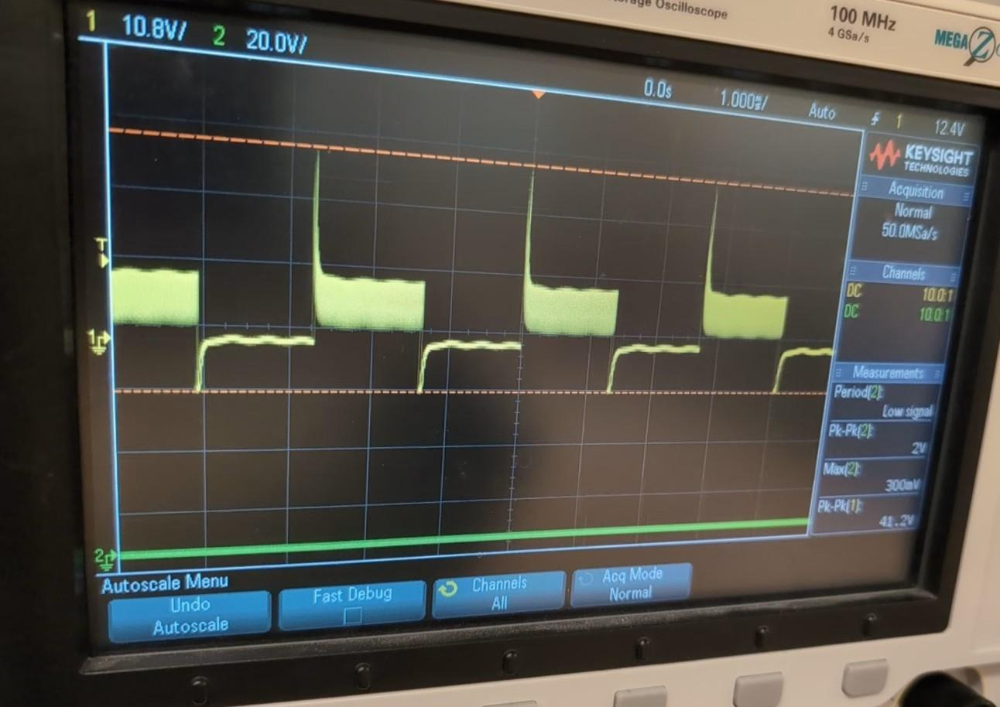
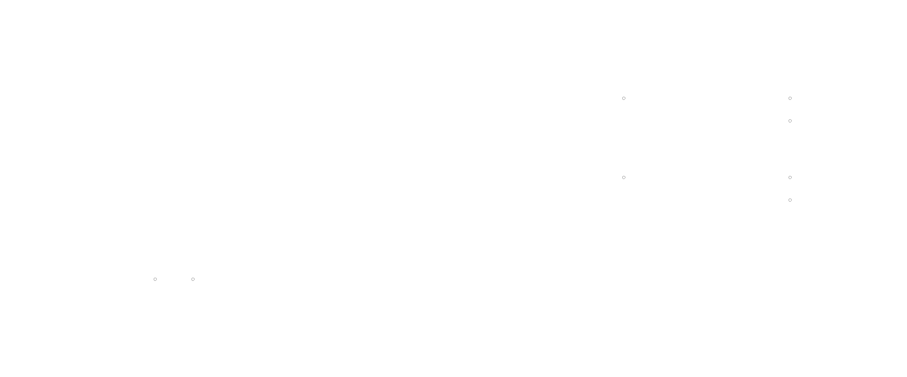
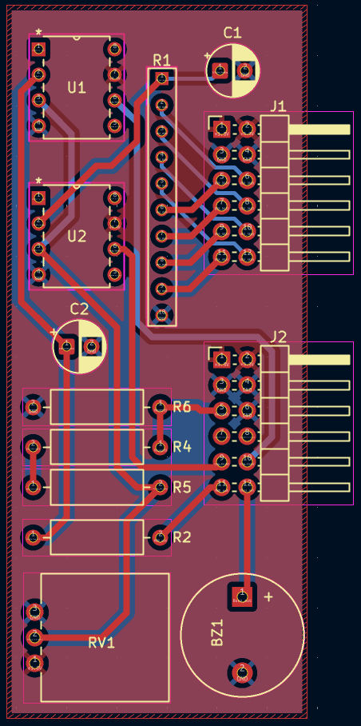

*<div align="right"> Vikram Procter | Nov, 2025 </div>*

# FPGA MIDI Buzzer Player

## Project Overview
  
*Photo of finished project*

Using a Basys3 Artix-7 FPGA development board I designed an  SystemVerilog framework to playback MIDI music to a buzzer. The project uses python scripts I wrote to parse MIDI files and generate ready to use SystemVerilog files that store the music data. 

This project was an extension for a final project for ENEL 453 a Digital Systems Design course at University of Calgary. The original project required us to create an ADC circuit and the required digital architecture to operate and display the ADC value. 

## Systems Overview
  
*RTL Schematic Generated Using Vivado*

The buzzer music playback system is built from three main functional modules: *Song Player Timer, Buzzer PWM, Volume Control*. These modules are supported by 3 look up table memory segments, MIDI Index to PWM Period, the song note pitches and the song note durations. The song’s note pitches and durations are stored serially in memory and dictates the PWM frequency supplied to the buzzer and how long each frequency is played for. The buzzer volume can also be adjusted using the analog input to the ADCs implemented in the original project.

A custom PCB was designed to connect to the headers of the Basys3 board, this allowed for easy connection to the pins of the R2R ladder used as a DAC, to create a variable analog voltage, and connect to the buzzer. This board was developed in KiCad and the files can be found in the repo.

The ADC portion of the ENEL 453 project was completed as a group project with Caleb Garcia and Chloe Fulbrook. You can find the full repo to all of the project files here: [https://github.com/cwlebgarcia/ENEL-453](https://github.com/cwlebgarcia/ENEL-453)


## MIDI Music Player 
### Python MIDI interpreter

The `MidiToBoard.py` uses the Mido python library which extracts each of the midi files messages into a python friendly list. My program parses through each of these messages identifying each note pitch and duration. The provided MIDI duration is in ticks and a calculation using the provided tempo messages is done to convert the tick count durations into micro-seconds. This program produces two lists, one containing the pitches for each note in the song and the other holds the duration of each note (in us).

The `gen.py` script uses the lists generated by `MidiToBoard.py` to creates two SystemVerilog files for the note pitches and the note durations. These pairs of files make up each song and are added to the project, where select switches and a mux determine which song is played.

```systemverilog
module song0_dur #(
    parameter int CLOCK_FREQ = 100_000_000
) (
    input logic [10:0] note_index,
    output logic [28:0] note_dur // max 10s at 100MHz clock
);

localparam real TEMPO_BPM = 120;
localparam real CYCLES_PER_BEAT = CLOCK_FREQ*(60/TEMPO_BPM);

always_comb begin
    // the quarter note is one beat and therefore can be multiplied by CYCLES_PER_BEAT
    case (note_index)
        0: note_dur = CYCLES_PER_BEAT * 0.65;
        1: note_dur = CYCLES_PER_BEAT * 0.1;
        2: note_dur = CYCLES_PER_BEAT * 0.25;
        ...
```

### SystemVerilog Music Playback Architecture
The Song Player Timer module drives the music playback. It increments through each note of the song as an index, keeping track of when each notes' duration has elapsed. The module references the *Note Duration Memory* to provide the length of the current note (`cur_note_dur`). When a different song is selected the module resets the note index and clears the elapsed time counter to start on the next track.

The Buzzer PWM module works in conjunction with a look up table that maps each MIDI note index (an index for all playable notes 0-127) to the  period of the PWM output needed to generate the note's frequency. The Buzzer PWM module outputs a 50%-duty-cycle PWM signal supplied to the buzzer.


*Buzzer Oscilloscope Trace Demonstrating Volume PWM*

The **Buzzer Volume Module** adjusts the buzzer's loudness using the averaged output of the selected ADC. This takes advantage of the low pass mechanical properties of the buzzer. The buzzer can’t physically respond to frequencies higher than ~15-20kHz. By driving the buzzer with a higher frequency, variable duty cycle PWM essentially a lower voltage can be provided to the buzzer. The output of the audio PWM is multiplied by this higher frequency voltage modulating PWM to achieve dynamic volume control. 


## The PCB 
The custom PCB integrates a PWM-low-pass-filter DAC unit along with a R2R ladder DAC used with a comparator to operate the ADCs. The PCB also uses a potentiometer to produce a variable analog voltage for testing the ADCs. As well, most importantly to this project the PCB also connects to the piezo-electric buzzer.


*PCB Schematic in KiCad*


*PCB Layout Schematic in KiCad*


*PCB Printed and Soldered*
